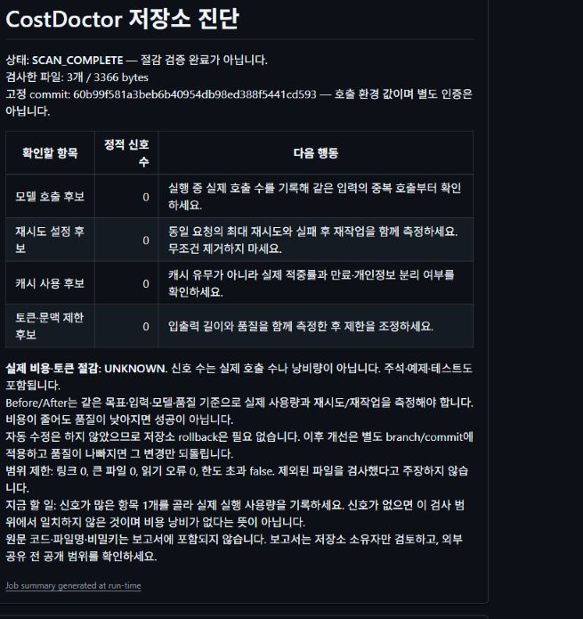

<!-- COSTDOCTOR_PUBLIC_URL_SCAN_START -->
# CostDoctor 무료 GitHub 비용 진단

[](https://github.com/leesugwan-dot/cost-doctor-github-app/actions/workflows/public-scan-selftest.yml)
[](https://github.com/leesugwan-dot/cost-doctor-github-app/actions/workflows/codeql.yml)

## 공개 저장소 — 가장 간단한 방법

**GitHub 주소 하나만 넣으면 됩니다.** 공개 저장소를 GitHub-hosted runner에서 정적 분석하고 결과를 같은 GitHub 이슈에 자동으로 남깁니다.

[**▶ 공개 저장소 무료 진단 시작**](https://github.com/leesugwan-dot/cost-doctor-github-app/issues/new?template=public-scan.yml)

1. 링크를 엽니다.
2. 자신의 **공개 GitHub 저장소 주소**를 붙여넣습니다.
3. 결과 언어를 고르고 `Submit new issue`를 누릅니다.
4. CostDoctor가 자동 분석하고 결과·검증 영수증을 남긴 뒤 요청을 닫습니다.

사용자의 프로젝트는 CostDoctor 운영자의 개인 PC로 보내지 않습니다. 대상 코드를 실행하지 않고 GitHub-hosted runner의 임시 작업공간에서 제한된 정적 분석만 수행합니다. 원문 코드·파일명·비밀정보는 공개 결과에 포함하지 않습니다. 실제 호출 수·비용·토큰 절감·품질 개선은 별도 Before/After Evidence가 없으면 `UNKNOWN`입니다.

## 비공개 저장소 — 코드를 운영자에게 보내지 않는 Self-Scan

private repository는 공개 URL 진단에 주소를 넣지 않습니다. 대신 저장소 소유자가 자신의 repository에 **읽기 전용 GitHub Actions workflow**를 설치해 자기 GitHub-hosted runner 안에서 실행할 수 있도록 준비했습니다.

[**비공개 저장소 Self-Scan 안내**](docs/PRIVATE_REPO_SELF_SCAN.md) · [읽기 전용 workflow](costdoctor-entry/private-repo-selfscan.yml)

이 경로도 CostDoctor 운영자의 개인 PC에 private source를 보내지 않으며, 기본 권한은 `contents: read`이고 자동 commit/push/PR/merge를 하지 않습니다. 외부 사용자의 실제 private repository 설치 편의성은 아직 별도 actual-run Evidence가 필요합니다.
<!-- COSTDOCTOR_PUBLIC_URL_SCAN_END -->

<!-- ACTUAL_SCREEN_GUIDE_R1_START -->
## 사진 보고 시작하기

[5분 Quick Start — 시간 보장 아님](costdoctor-entry/docs/QUICKSTART_VISUAL.md) · [실제 화면 13장 / 14단계 가이드](costdoctor-entry/docs/SCREEN_GUIDE.md) · [FAQ](costdoctor-entry/docs/FAQ.md)

아래는 기존 실제 GitHub 실행의 Summary입니다. 녹색 실행·신호 0건은 비용절감 PASS가 아닙니다. 실행·버전과 연결한 사진으로 설치, Actions, 보고서, 오류, 되돌리기를 안내합니다.



<!-- ACTUAL_SCREEN_GUIDE_R1_END -->

<!-- COSTDOCTOR_PUBLIC_ENTRY_START -->
## CostDoctor: App 없이 GitHub에서 시작

**공개 진입점 Pilot / GitHub Ubuntu 실제 실행·보고서 재계산 PASS / Production Authority=false**

[시작·설치](costdoctor-entry/docs/GITHUB_PILOT.md) · [한 파일 workflow](costdoctor-entry/costdoctor-onefile.yml) · [결과 예시](costdoctor-entry/examples/report.md) · [권한·정보수집](costdoctor-entry/docs/PRIVACY_PERMISSIONS.md) · [오류](costdoctor-entry/docs/TROUBLESHOOTING.md) · [중단·되돌리기](costdoctor-entry/docs/ROLLBACK.md)

자신의 공개 저장소에서 workflow 한 파일을 기본 branch의 `.github/workflows/costdoctor.yml`로 저장하고 **Actions → CostDoctor repository review → Run workflow**를 실행합니다. 완료된 실행의 **Summary**에서 검토 후보와 다음 행동을 확인합니다. 이 저장소의 동일 workflow 실제 실행도 성공했습니다.

모델/API key/App 설치 없이 저장소를 읽는 정적 진단입니다. 실제 호출 수·비용 절감·품질 인증이 아닙니다. 소스 수정/merge 차단은 하지 않습니다. 보고서는 원문 코드·파일명·secret을 담지 않습니다. 표준 public runner만 사용하며 private/유료 runner로 자동 전환하지 않습니다.

이번 공개 허용 범위는 `costdoctor-entry`의 entry/Action/workflow/README/안내/공개 예제 및 실행용 workflow입니다. 아래 기존 App 문서와 `public_boundary.json`은 이전 App의 범위로 보존하며, 이번 공개가 비공개 core/backend/원문 Evidence를 허용하지 않습니다. 검증한 구현 commit은 `60b99f581a3beb6b40954db98ed388f5441cd593`입니다. [고정 설치 파일](https://github.com/leesugwan-dot/cost-doctor-github-app/blob/60b99f581a3beb6b40954db98ed388f5441cd593/costdoctor-entry/costdoctor-onefile.yml) · [Raw 복사용](https://raw.githubusercontent.com/leesugwan-dot/cost-doctor-github-app/60b99f581a3beb6b40954db98ed388f5441cd593/costdoctor-entry/costdoctor-onefile.yml) · [실제 실행·Summary](https://github.com/leesugwan-dot/cost-doctor-github-app/actions/runs/33983233394). 17초는 서버 실행 시간이며 사람의 설치 시간이나 비용절감 수치가 아닙니다. 다른 계정의 설치·사용성은 아직 미검증입니다.
<!-- COSTDOCTOR_PUBLIC_ENTRY_END -->

---
## 이전 GitHub App 문서 — 기존 경계 보존

# Cost Doctor GitHub App

PR의 AI·모델 사용 비용 관련 코드 신호를 요약하고, 검증 가능한 사용량 Evidence가 있을 때만 관측된 절감액을 GitHub Check로 표시하는 비공개 GitHub App 후보입니다.

> 상태: `PUBLIC_PILOT_CANDIDATE / APP_PRIVATE_UNTIL_FINAL_PUBLIC_GATE / PRODUCTION_AUTHORITY_FALSE`

공개 문서에는 설치·권한·운영 설명만 있으며 비공개 분석 서비스와 테스트 코드는 포함하지 않습니다.

## 30초 요약

- 대상: 모델 호출 비용을 PR 단위로 확인하려는 저장소 운영자
- 입력: 허용된 저장소의 `pull_request` 이벤트와 정확한 head commit
- 확인: 모델 호출, 재시도, 캐시, 토큰 제한 관련 정적 코드 신호
- 출력: 원문 코드·파일명·로컬 경로를 제외한 GitHub Check 요약
- 절감액: 서명된 원본 사용량 Evidence와 승인된 측정 계약이 검증된 경우에만 표시하며 그 외에는 `UNKNOWN`

[Quick Start](docs/QUICKSTART.md) · [실제 결과](docs/REAL_RESULTS.md) · [Pilot 결과 보고](docs/PILOT_FEEDBACK.md) · [문제 해결](docs/TROUBLESHOOTING.md) · [제거](docs/UNINSTALL.md) · [지원](SUPPORT.md)

공개 허용 후 설치 페이지: [Cost Doctor Staging Pilot R2](https://github.com/apps/cost-doctor-staging-pilot-r2). 현재는 소유자에게만 `Configure`가 보이며 외부 `Install` 노출은 최종 공개 Gate에서 확인합니다.

## 현재 검증 범위

| 항목 | 상태 | 의미 |
| --- | --- | --- |
| 로컬 회귀검증 | `PASS (55/55)` | 저장된 R4 구현의 격리 재실행 |
| 로컬 모의 GitHub 흐름 | `PASS` | 실제 네트워크가 아닌 가짜 전송 계층 검증 |
| 실제 GitHub App 등록·설치 | `PASS (temporary isolated actual E2E)` | 현재 release의 등록·설치·서명·정확한 head SHA·Check readback 검증 |
| clean test repository 첫 PR | `PASS (temporary isolated actual E2E)` | 공개 사용자 설치가 아닌 내부 격리 실증 |
| 공개 pilot | `FINAL_GATE_PENDING` | 외부 사용자 설치·반복 사용 Evidence는 아직 없음 |
| Production enforcement | `false` | merge 차단·Production 권한 없음 |
| 실제 workload | `2/2 bounded PASS` | 가격 고정 API의 두 workload 결과만 유효하며 일반화 금지 |

## 동작 방식

```text
PR 생성/갱신 → Webhook·저장소 범위 검증 → PR head SHA 재확인
→ 정확한 commit을 비공개 임시공간에서 분석 → 요약 Check 생성·readback
→ 임시 소스 삭제
```

Check 이름은 `Cost Doctor`입니다. 서명된 telemetry가 검증되면 결론은 `success`, 그렇지 않으면 `neutral`입니다. 이 구현은 `PASS / REVIEW / BLOCK` 판정기나 merge 차단기가 아닙니다.

현재 규칙은 `MODEL_CALL`, `RETRY_LOOP`, `CACHE_SIGNAL`, `TOKEN_LIMIT` 네 종류입니다. 신호 발견만으로 비용 낭비나 절감효과를 확정하지 않습니다.

## 최소 권한

| GitHub App 권한 | 수준 | 용도 |
| --- | --- | --- |
| Pull requests | Read | PR과 정확한 head commit 확인 |
| Contents | Read | 정확한 commit 압축본 읽기 |
| Checks | Write | 요약 Check 생성·readback |

이벤트는 `pull_request`, action은 `opened`, `reopened`, `synchronize`, `ready_for_review`로 제한합니다. 저장소 파일·PR·commit·issue·comment 수정 권한과 사용자 OAuth는 요구하지 않습니다.

## Check 결과

- `finding_count`: 탐지 신호 개수
- `telemetry_verdict`: 사용량 Evidence 검증 결과
- `savings_status`: `VERIFIED_OBSERVED` 또는 `UNKNOWN`
- `verified_savings`: 검증됐을 때만 숫자, 그 외 `null`
- `raw_source_output`: 항상 `false`

`neutral`은 절감액을 입증할 telemetry가 없거나 검증되지 않았다는 뜻입니다. 실제 절감효과 PASS로 해석하면 안 됩니다.

## 개인정보·보안

- 원문 commit 압축본은 비공개 임시공간에서 읽고 정상 처리 경로에서 제거합니다.
- Check에는 원문 코드, 파일명, 로컬 경로, 토큰, 비밀정보를 넣지 않습니다.
- Webhook 원문 바이트를 HMAC-SHA256으로 먼저 검증합니다.
- 비용 telemetry 신뢰 저장소는 선택 사항입니다. 구성하지 않으면 절감 상태는 `UNKNOWN`입니다.
- 현재 외부 사용자 telemetry 수집 서비스는 연결돼 있지 않습니다. 운영주체·보존기간·삭제 절차는 공개 전에 확정해야 합니다.

[개인정보 고지 초안](PRIVACY_DRAFT.md)과 [보안 경계](SECURITY.md)를 함께 확인하세요.

## 제한사항

- GitHub App + 비공개 단일 호스트 서비스 후보이며 GitHub Action이나 데스크톱 앱이 아닙니다.
- hosted endpoint와 내부 actual E2E는 검증됐지만, 외부 사용자용 공개 설치 허용은 최종 공개 Gate 전입니다.
- 탐지는 제한된 텍스트 확장자와 정적 규칙에 한정됩니다.
- telemetry가 검증되지 않으면 절감액은 `UNKNOWN`입니다.
- Check와 Required Status Check·Repository Ruleset의 merge 강제는 별개입니다.
- 서로 다른 SQLite 장부를 쓰는 다중 호스트 배포는 지원하지 않습니다.

## 실제 결과

상태: `BOUNDED_2_WORKLOAD_EVIDENCE / EXTERNAL_PILOT_EVIDENCE_PENDING`

동일 모델·동일 조건의 두 실제 API workload에서 품질 100 유지, False-PASS 악화 0, 가격표 기반 사용량 비용 21.0354%와 10.8970% 감소를 각각 관측했습니다. 청구서 영수증이 아닌 고정 가격표 기반 계산이며 모든 저장소에 일반화하지 않습니다. 상세 경계는 [실제 결과](docs/REAL_RESULTS.md)에 있습니다.

[공개·운영 Gate](PUBLICATION_GATES.md) 전에는 설치 가능 제품이나 Production 완료로 표시하지 않습니다.
