# 실제 화면으로 따라가는 14단계 GitHub 가이드

[빠른 시작](QUICKSTART_VISUAL.md) · [FAQ](FAQ.md) · [결과](RESULTS.md) · [오류](TROUBLESHOOTING.md)

2026-09-06 실제 공개 GitHub 화면 **G01–G13**입니다. 합성 화면이나 예제 결과를 실제 실행으로 표시하지 않았습니다. 이전 실전시험 가이드의 S01–S13은 별도 역사 시험 장면이므로 번호를 바꿔치기하지 않습니다.

검증한 실행 구현: `60b99f581a3beb6b40954db98ed388f5441cd593`. [실제 Run](https://github.com/leesugwan-dot/cost-doctor-github-app/actions/runs/33983233394). 촬영 당시 문서 commit: `d5dd0d28254559ff94b8ba00d03c060ead375d5d`. Guide-only 후속 commit은 화면 속 실행 버전을 바꾸지 않습니다.

## 1. 저장소에서 시작

첫 README의 GitHub 진입점 안내를 엽니다. 과거 App 설명과 현재 파일 1개 설치 경로를 구분합니다.

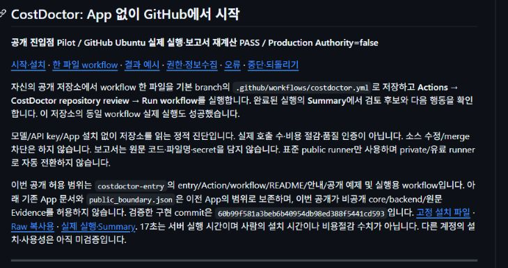

**사진의 범위:** 이 사진은 실제 공개 README이며 소유자 로그인 영역은 제외했습니다.

## 2. 권한·정보 범위 확인

설치 쓰기 권한과 도구의 contents 읽기 권한을 구분합니다. 비밀키·모델 계정은 필요하지 않습니다.

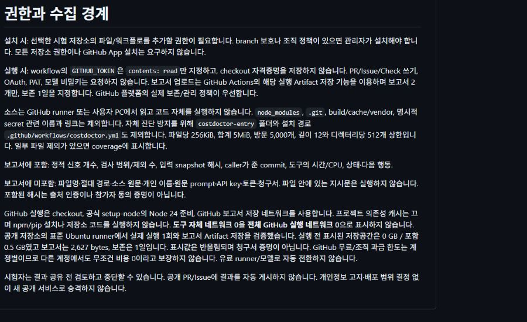

**사진의 범위:** 공개 보고서는 집계값 중심입니다. GitHub 플랫폼의 저장소·실행 메타데이터까지 익명화된다는 뜻은 아닙니다.

## 3. 설치 순서 읽기

자신의 시험 저장소에 동의한 뒤 6개 설치·실행 단계를 확인합니다.

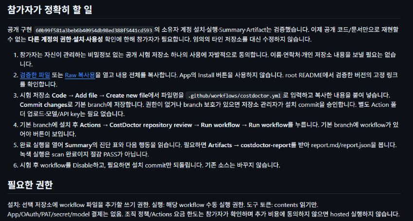

**사진의 범위:** 다른 사람의 저장소를 이 문서 작성 과정에서 수정하거나 시험한 것이 아닙니다.

## 4. 검증한 workflow 전체 복사

[고정 파일](https://github.com/leesugwan-dot/cost-doctor-github-app/blob/60b99f581a3beb6b40954db98ed388f5441cd593/costdoctor-entry/costdoctor-onefile.yml)의 Raw/복사를 사용합니다. 화면에 보이는 일부 줄만 복사하지 않습니다.

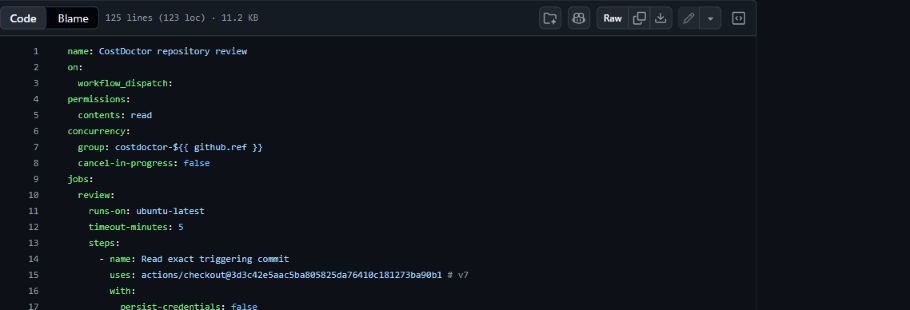

**사진의 범위:** 사진은 실제 YAML의 도구 버튼과 상단입니다. 파일 전체는 링크에서 복사합니다.

## 5. 내 저장소에 workflow 추가

Code → Add file → Create new file에서 `.github/workflows/costdoctor.yml`을 입력하고 전체 내용을 붙여 넣은 뒤 Commit changes로 기본 branch에 저장합니다. 기존 파일이 있으면 비교부터 합니다.

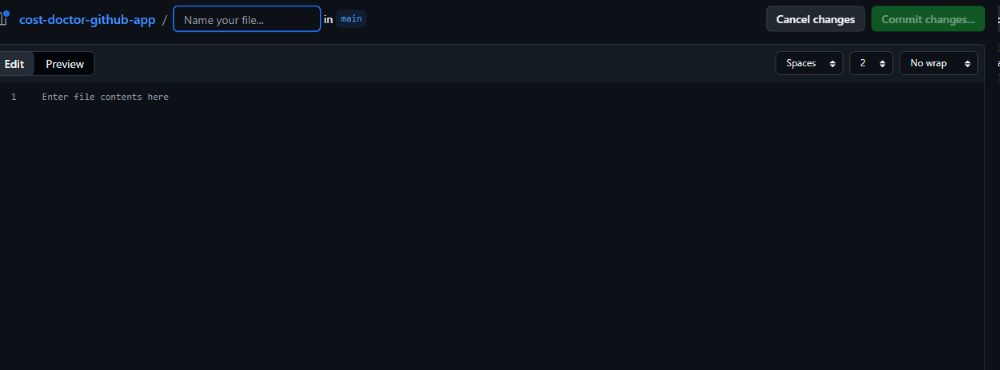

**사진의 범위:** 이 사진은 실제 빈 편집 화면입니다. 이번 촬영에서는 입력·Commit을 하지 않았고, 이미 설치된 결과를 재사용했습니다.

## 6. 설치 경로와 버전 확인

`.github/workflows/costdoctor.yml`이 저장됐는지 봅니다. 이 예시의 설치 commit은 `60b99f5`입니다.

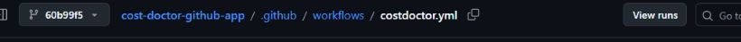

**사진의 범위:** 소비자 저장소의 commit SHA는 달라도 됩니다. 복사한 원본의 고정 SHA와 설치 commit을 함께 기록하세요.

## 7. Actions에서 workflow 찾기

Actions 탭에서 CostDoctor repository review를 선택합니다. 기본 branch에 설치돼야 수동 실행 버튼이 보입니다.

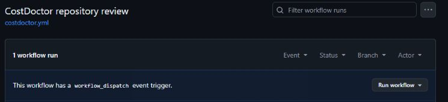

**사진의 범위:** 여기서는 실제 목록을 읽었고 실행을 추가하지 않았습니다.

## 8. Run workflow 실행하기

Run workflow 메뉴에서 설치한 기본 branch를 확인하고 초록 버튼을 누릅니다. 기존 진행 중 실행이 있으면 중복 누르지 않습니다.

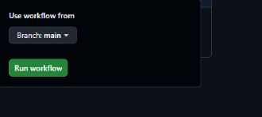

**사진의 범위:** 사진은 실제 메뉴이며 버튼은 누르기 전입니다. 이 가이드 촬영으로 새 실행·새 사용량을 만들지 않았습니다.

## 9. 완료 상태 보기

[기존 실제 실행](https://github.com/leesugwan-dot/cost-doctor-github-app/actions/runs/33983233394)의 Status가 Success인지 확인합니다. 실패하면 [오류 안내](TROUBLESHOOTING.md)를 봅니다.

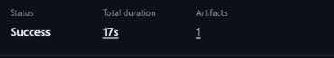

**사진의 범위:** 17초는 이 서버 실행의 관측값입니다. 외부 시험자의 설치 시간이나 비용절감률이 아닙니다.

## 10. Summary 해석하기

검사 파일 수·bytes·제외 범위를 먼저 읽고 4종 정적 신호를 봅니다. `SCAN_COMPLETE`는 제한 범위 검사 완료입니다.

**사진의 범위:** 이 실행은 3파일/3,366 bytes/4종 신호 0입니다. 비용절감 UNKNOWN, 품질 NOT_MEASURED를 그대로 유지합니다. [결과 읽기](RESULTS.md)

## 11. Artifact에서 보고서 받기

Artifacts → costdoctor-report를 선택합니다. report.md는 사람용, report.json은 기계 비교용입니다.

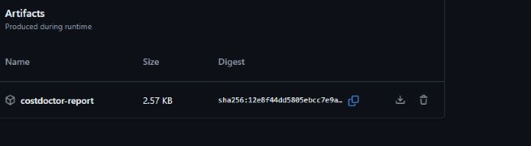

**사진의 범위:** 사진의 Artifact는 실제 2.57KB이며 보고서 2개만 있습니다. 1일 만료 후에는 다운로드가 안 될 수 있습니다. 새 다운로드나 삭제를 촬영 목적으로 수행하지 않았습니다.

## 12. 경고와 실패 구분하기

Annotations의 경고를 확인합니다. 이 실행에는 upload-artifact의 Node.js 전환 경고가 1개 있습니다.

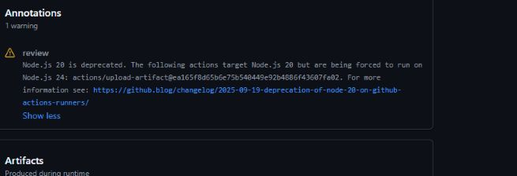

**사진의 범위:** 실행은 성공했습니다. 경고를 숨기거나 실패로 바꾸지 않습니다. [FAQ](FAQ.md)의 대응을 참고하세요. 의도적 오류 주입 화면으로 대체하지 않습니다.

## 13. 중지·되돌리기 확인

실행 중이면 Cancel workflow, 이후 Disable workflow를 사용합니다. 완전 제거는 설치 commit만 Revert하며 보호 규칙을 따릅니다.

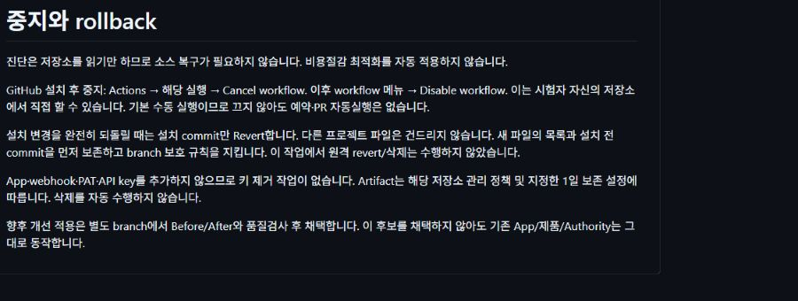

**사진의 범위:** 사진은 실제 rollback 안내 문서입니다. 이번 촬영에서 원격 중지·삭제·Revert를 실행했다는 증거는 아닙니다.

## 14. 내 시험 결과를 확인하고 피드백하기

설치한 버전, 첫 Summary까지 걸린 시간, 성공/고정 오류코드, 결과를 이해하고 다음 행동을 정할 수 있었는지만 기록합니다. [시험·피드백 안내](GITHUB_PILOT.md)의 최소 항목을 사용하세요. 계정 ID, 원문 코드, 파일명, 키, 프롬프트, 청구서를 보내지 않습니다. 실행 URL은 별도 공유 동의가 있을 때만 선택사항입니다.

**PR 안내:** 현재 기본 workflow는 `workflow_dispatch` 수동 실행입니다. PR 자동 진단, Check Run 생성 또는 merge 강제를 이 설치 경로가 제공한다고 해석하지 마세요. PR에서 개선을 검토하려면 관리자의 기존 절차와 [Before/After·품질 기준](RESULTS.md)을 따릅니다. 이 가이드를 만든 작업에서 새 PR을 생성하지 않았습니다.

**아직 증명하지 않은 것:** 실제 다른 계정의 초보자 재현·설치 시간·이해도는 참가자의 자발적 시험이 필요합니다. 이번 공개 화면 캡처는 그 검증을 쉽게 하기 위한 자료이지, 외부 사용자가 시험했다는 증거가 아닙니다. 과거 S04–S05/S09–S10의 비용 Before/After, S06 오류 주입, S11–S12 별도검증·clean rerun은 현재 정적 scan 화면으로 대체하지 않습니다.
